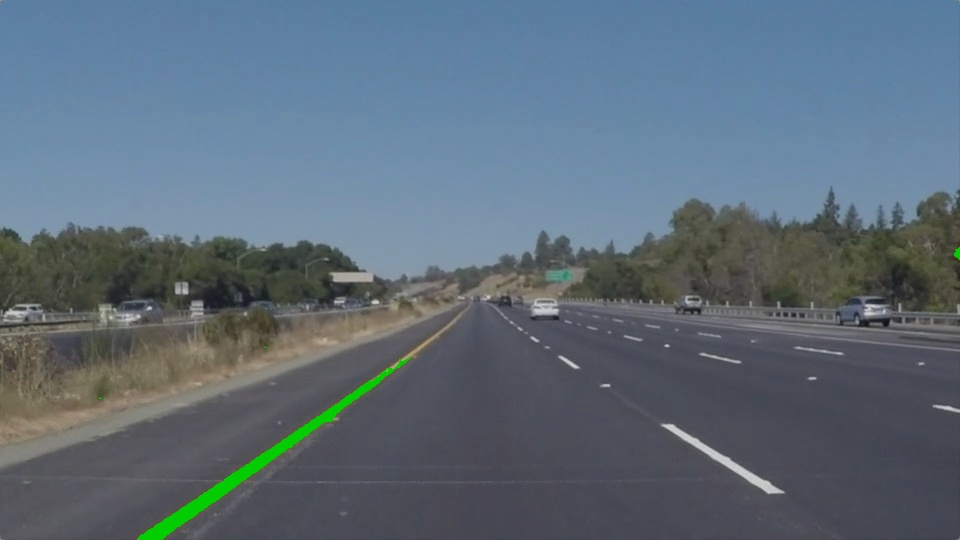

# Lane Detection Project

This project implements a lane detection system using computer vision techniques and deep learning.


- [Introduction](#introduction)
- [Features](#features)
- [Installation](#installation)
- [Usage](#usage)
- [Project Structure](#project-structure)
- [Configuration](#configuration)
- [Contributing](#contributing)
- [License](#license)
- [Contact](#contact)


## Introduction

Lane detection is a crucial component of advanced driver assistance systems (ADAS) and autonomous vehicles. This project aims to develop a robust lane detection algorithm capable of accurately identifying lane boundaries in images and videos captured by a vehicle's onboard camera.

## Features

- Detects lane boundaries in images and videos.
- Supports real-time lane detection.
- Provides visualization of detected lanes overlaid on input images/videos.
- Supports both straight and curved lane detection.
- Uses deep learning models for enhanced accuracy.
- Logs training and evaluation metrics for model performance analysis.


## Installation

1. Clone the repository:

    ```bash
    git clone https://github.com/Ashok-Prajapati2/Road-lane-line-detection.git
    ```

2. Install dependencies:

    ```bash
    cd Road-lane-line-detection
    pip install -r requirements.txt
    ```

3. Run the application:

    ```bash
    python app/main.py
    ```

## Usage

1. Place input images or videos in the `data/test_images/` or `data/test_videos/` directory.
2. Run the application using the provided instructions.
3. View the output results in the `results/` directory.


## Configuration

Configuration files are located in the `config/` directory:

- `environment.yml`: Specifies the conda environment setup.
- `parameters.json`: Contains configurable parameters for the lane detection algorithm.


## Contributing

Contributions are welcome! 

## License

This project is licensed under the MIT License. See the [LICENSE](LICENSE) file for details.

## Acknowledgements

- This project was inspired by [Lane Detection using OpenCV](https://github.com/Ashok-Prajapati2/Road-lane-line-detection.git) by [Ashok Kumar](https://github.com/Ashok-Prajapati2).


## Contact

For questions or feedback, please contact [Ashok Kumar](mailto:ap86963163@gmail.com).


## Examples

### Images

Here are some examples of lane detection on input images:





### Videos

Here are some examples of lane detection on input videos:

- [Example Video 1](results/videos/detected_lane_1716694824.7354543.mp4)
- [Example Video 2](results/videos/detected_lane_1716694942.5413072.mp4)
- [Example Video 3](results/videos/detected_lane_1716695074.6446207.mp4)
- [Example Video 4](results/videos/detected_lane_1716695496.300908.mp4)
- [Example Video 5](results/videos/detected_lane_1716695525.7180731.mp4)


## Project Structure

Road-lane-line-detection/
├── app/
│ ├── gen_log.py
│ ├── init.py
│ ├── main.py
├── build/
│ └── lib/
│ ├── app/
│ └── lane_detection/
├── config/
│ ├── environment.yml
│ └── parameters.json
├── data/
│ └── test_videos/
├── dist/
│ └── lane_detection-1.0-py3.12.egg
├── docs/
│ ├── development.md
│ ├── model.pdf
│ └── project_work.docx
├── lane_detection/
│ ├── detector.py
│ ├── init.py
│ ├── preprocessor.py
│ ├── tracker.py
│ └── utils.py
├── models/
│ ├── logs/
│ ├── model.ipynb
│ ├── model_link.txt
│ ├── outputs/
│ ├── sample_data/
│ └── testing/
├── notebooks/
│ ├── lane_detection.ipynb
│ ├── logs/
│ ├── model_test.ipynb
│ └── outputs/
├── results/
│ ├── images/
│ ├── logs/
│ ├── masks/
│ └── videos/
├── scripts/
│ └── setup.py
├── README.md
├── requirements.txt

