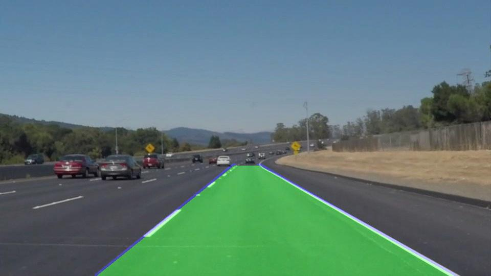
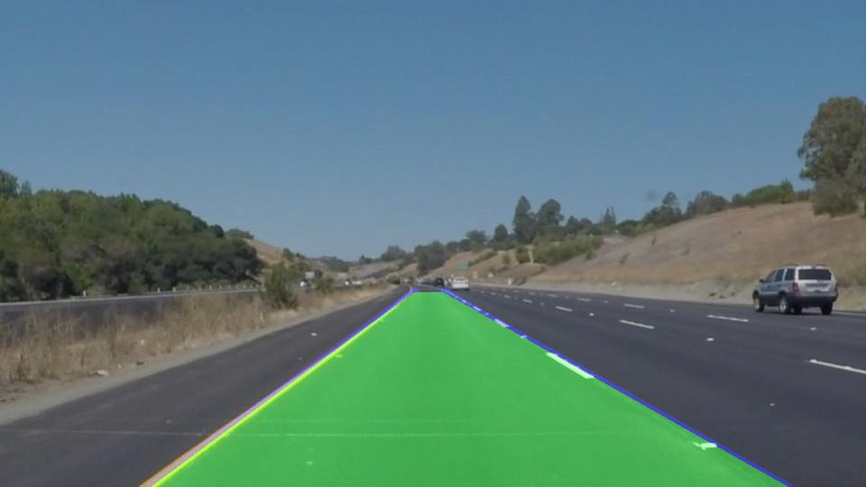

# Lane Detection Project

This project implements a lane detection system using computer vision techniques and deep learning.


- [Introduction](#introduction)
- [Features](#features)
- [Installation](#installation)
- [Usage](#usage)
- [Configuration](#configuration)
- [Contributing](#contributing)
- [License](#license)
- [Contact](#contact)
- [Examples](#examples)

## Introduction

Lane detection is a crucial component of advanced driver assistance systems (ADAS) and autonomous vehicles. This project aims to develop a robust lane detection algorithm capable of accurately identifying lane boundaries in images and videos captured by a vehicle's onboard camera.

## Features

- Detects lane boundaries in images and videos.
- Supports real-time lane detection.
- Provides visualization of detected lanes overlaid on input images/videos.
- Supports both straight and curved lane detection.
- Uses deep learning models for enhanced accuracy.
- Logs training and evaluation metrics for model performance analysis.


## Installation

1. Clone the repository:

    ```bash
    git clone https://github.com/Ashok-Prajapati2/Road-lane-line-detection.git
    ```

2. Install dependencies:

    ```bash
    cd Road-lane-line-detection
    pip install -r requirements.txt
    ```

3. Run the application:

    ```bash
    python app/main.py
    ```

    ```bash
    model/model.ipynb
    ```
## Usage

1. Place input images or videos in the `data/test_images/` or `data/test_videos/` directory.
2. Run the application using the provided instructions.
3. View the output results in the `results/` directory.

or 

1. Place input images  in the `notebooks/test_images` directory.
2. Run the script using the jupyter notbook or colob . 
3. View the output results in the `notebooks/outputs` directory.

or 

1. Place input  videos in the `models/testing`  directory.
2. Run the script using the jupyter notbook or colob . 
3. View the output results in the `models/videos` or `models/output` directory.

```bash change the image and videos name in `app/main.py` and notebooks.```

## Configuration

Configuration files are located in the `config/` directory:

- `environment.yml`: Specifies the conda environment setup.
- `parameters.json`: Contains configurable parameters for the lane detection algorithm.


## Contributing

Contributions are welcome! 

## License

This project is licensed under the MIT License. See the [LICENSE](LICENSE) file for details.

## Acknowledgements

- This project was inspired by [Lane Detection using OpenCV](https://github.com/Ashok-Prajapati2/Road-lane-line-detection.git) by [Ashok Kumar](https://github.com/Ashok-Prajapati2).


## Contact

For questions or feedback, please contact [Ashok Kumar](mailto:ap86963163@gmail.com).


## Examples

### Images

Here are some examples of lane detection on input images:






### Videos

Here are some examples of lane detection on input videos:

- [Video 1](results/videos/detected_lane_mask_1716694942.5413225.mp4)
- [Video 2](results/videos/detected_lane_1716694942.5413072.mp4)
- [Video 3](results/videos/detected_lane_1716695074.6446207.mp4)
- [Video 4](results/videos/detected_lane_1716695496.300908.mp4)
- [Video 5](/models/testing/challenge.mp4)


### Project Doc

- [Doc](/docs/project_work.pdf)

## Model
- [Model](https://drive.google.com/file/d/1G6ANBYpWUENjda6dgxAp77RduZ1slLnC/view?usp=drive_link)